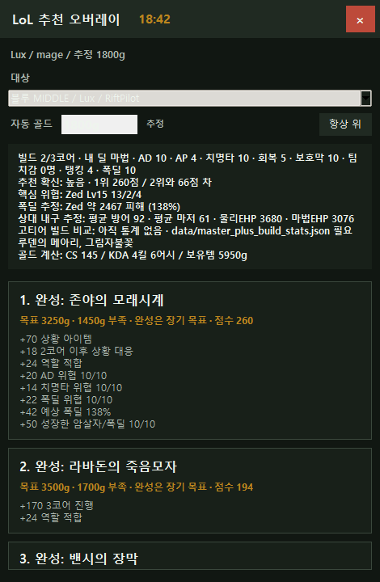

# RiftPilot

> Local-first, explainable item recommendation prototype for League of Legends.

[]()
[]()



## Project Documents

- [License](LICENSE)
- [Contributing Guide](CONTRIBUTING.md)
- [Changelog](CHANGELOG.md)
- [Roadmap](ROADMAP.md)
- [Development Log](DEVELOPMENT_LOG.md)

---

## Project Overview

RiftPilot is a local-first item recommendation prototype for League of Legends. It is designed to help players inspect item choices during gameplay and replay-style workflows by combining local game data, transparent heuristic scoring, and optional high-tier build statistics support.

The project runs in the user's local environment. It does not buy items, control the game client, or automate gameplay.

RiftPilot is currently focused on item recommendation, threat-aware scoring, and explanation of recommendation factors. It should be understood as an experimental prototype, not a production-grade coaching system.

---

## Why RiftPilot?

League of Legends itemization is contextual. Good item choices can depend on current gold, owned items, enemy champions, enemy items, damage type, healing, shielding, crowd control, and whether a specific opponent is ahead.

RiftPilot aims to provide item recommendations based on the actual game state rather than fixed build paths. The recommendation logic is intentionally inspectable so users can see why an item was suggested.

---

## Current Features

The following features are implemented in the current codebase:

- Local web dashboard for demo, live, sample replay, and replay-style workflows
- Desktop overlay built with Python/Tkinter
- Local Node.js server for static files and proxy endpoints
- Riot Local API proxy support
- Riot replay-style endpoint support when local replay data is available
- Riot Data Dragon proxy for item and champion metadata
- Heuristic item recommendation logic
- Threat-aware item scoring for damage type, healing, shielding, crowd control, burst risk, and item timing
- Automatic gold estimation when exact gold is not available
- Optional Master+ build statistics collector
- Optional 1-core, 2-core, and 3-core build path comparison when local stats are available
- Recommendation confidence and score-gap display
- Recommendation snapshot output to `data/latest_recommendation.json`
- Regression tests for selected recommendation logic
- Development log documenting major implementation changes

---

## Run

Start the local server:

```powershell
node server.js
```

Open:

```text
http://127.0.0.1:5177/
```

Run the desktop overlay:

```powershell
python overlay.py
```

or:

```powershell
start-overlay.bat
```

Run regression tests:

```powershell
python -B test_overlay_logic.py
```

---

## How It Works

- `server.js` serves the web app and proxies local Riot endpoints.
- `/api/live` reads Riot Live Client Data API data when a live game is available.
- Replay-style workflows use local replay endpoints when Riot's local client exposes them.
- `/api/ddragon` retrieves Riot Data Dragon item and champion metadata.
- `app.js` powers the web dashboard and recommendation panels.
- `overlay.py` powers the desktop overlay and recommendation engine.
- `collect_master_build_stats.py` can optionally generate local Master+ build statistics with a user-provided Riot API key.

---

## Desktop Overlay

The overlay provides:

- Always-on-top recommendation panel
- Draggable desktop window
- Target champion selection
- Automatic gold estimation
- Threat analysis
- Purchase timing guidance
- Recommendation confidence score
- Anti-heal, anti-shield, and anti-critical item considerations
- Latest recommendation snapshot export

---

## Optional Master+ Build Statistics Support

RiftPilot can use locally generated Master+ build statistics if `data/master_plus_build_stats.json` exists.

The collector requires a Riot API key:

```powershell
$env:RIOT_API_KEY = "RGAPI-..."
python collect_master_build_stats.py
```

The collector can aggregate first, second, and third core item paths from Riot API match and timeline data. These statistics are optional and are not bundled as a production dataset.

Example schema:

```text
data/master_plus_build_stats.example.json
```

---

## Recommendation Factors

Recommendations may consider:

- Champion role or archetype
- Current gold
- Current inventory
- Build completion progress
- Enemy champion and item context
- Physical and magic damage pressure
- Healing and shielding threats
- Crowd control pressure
- Burst-risk estimates
- Effective health estimates
- Optional Master+ build path statistics
- Recommendation confidence and score gap

The scoring is heuristic-based and explainable. It is not an exact full combat simulator.

---

## Limitations / Not Implemented

RiftPilot is an early-stage prototype. The following are not implemented as current features:

- Direct `.rofl` file parsing
- Automatic item purchasing
- Gameplay automation
- Exact full champion damage simulation
- Complete champion-specific coverage
- Built-in production Master+ dataset
- Packaged desktop installer
- Production-grade recommendation accuracy validation

Replay-style support depends on what the local Riot client exposes while a game or replay is running.

---

## Planned Work

Near-term planned work is tracked in [ROADMAP.md](ROADMAP.md) and GitHub Issues.

Current planning areas include:

- Replay workflow documentation
- Expanded regression test coverage
- Improved champion-specific item profiles
- Ban/Pick champion recommendation design
- Master+ build statistics documentation
- Packaged desktop release planning

These items are planned or design-stage work unless explicitly marked as implemented.

---

## Open Source Notes

RiftPilot is released under the [MIT License](LICENSE).

This project is not affiliated with Riot Games. Users are responsible for following Riot Games policies and API terms when using Riot local client APIs, replay endpoints, Data Dragon, or Riot developer APIs.
