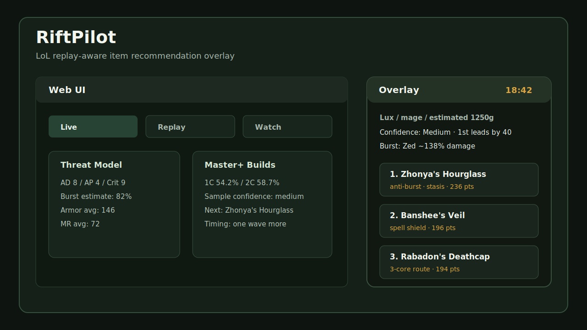

# RiftPilot

> Open-source AI Assistant for League of Legends

[]()
[]()



## Project documents

- [License](LICENSE)
- [Contributing Guide](CONTRIBUTING.md)
- [Changelog](CHANGELOG.md)
- [Roadmap](ROADMAP.md)
- [Development Log](DEVELOPMENT_LOG.md)

---

## Project Overview

RiftPilot is an open-source AI assistant designed to help League of Legends players make better decisions throughout an entire match.

Unlike traditional build websites that mainly display popular builds or win rates, RiftPilot analyzes live game information and recommends context-aware item builds based on the current game state.

The long-term goal of this project is to support players from champion select to post-game analysis by combining player history, team composition analysis, and AI-powered explanations.

The project runs entirely on the user's local environment using Riot's Local API and does not modify or automate gameplay.

---

## Why RiftPilot?

Many existing League of Legends tools only provide static statistics or popular builds.

However, real in-game decisions depend on much more than popularity.

Current gold, owned items, enemy champions, team composition, game progression, and player experience all influence the optimal decision.

RiftPilot aims to recommend recommendations based on the actual game state rather than fixed build paths.

---

## Current Features

- Real-time game data collection using Riot Local API
- Live item recommendation system
- Desktop overlay
- Local web interface
- Replay mode support
- Automatic gold estimation
- Enemy threat analysis
- Master+ build statistics
- Recommendation confidence score
- Recommendation snapshot saving
- Situation-based counter item recommendation
- Anti-heal recommendation
- Anti-shield recommendation
- Anti-critical recommendation

---

## Planned Features

- AI Champion Recommendation during Ban/Pick
- Player Match History Analysis
- Team Composition Synergy Analysis
- Counter Pick Recommendation
- Rune Recommendation
- Skill Order Recommendation
- AI Explanation for Recommendations
- Replay Performance Analysis
- Patch-aware Recommendation Engine
- AI Gameplay Coach

---

## Technology Stack

- Python
- Node.js
- JavaScript
- HTML / CSS
- Riot Local API
- Riot Data Dragon API
- Desktop Overlay
- JSON-based Build Database

---

## Roadmap

### Version 1.0

- Live Item Recommendation
- Desktop Overlay
- Replay Support
- Master+ Build Statistics

### Version 1.5

- Champion Recommendation
- Draft Assistant
- Player History Analysis

### Version 2.0

- Rune Recommendation
- Skill Order Recommendation
- AI Explanation Engine

### Version 3.0

- Replay Analysis
- AI Match Review
- Gameplay Feedback
- Patch Analysis

---

## Open Source

RiftPilot is developed as an open-source project.

Contributions are welcome through bug reports, feature suggestions, documentation improvements, and pull requests.

The project will continue evolving alongside future League of Legends patches.

---

# LoL Item Recommender MVP

This project provides a local recommendation panel that analyzes Summoner's Rift game data and recommends context-aware item choices.

It is a recommendation tool only and does **not** automate gameplay or purchase items automatically.

## Run

```powershell
node server.js
```

Open

```
http://127.0.0.1:5177/
```

## How It Works

- Reads live game information through Riot Local API.
- Supports live games, demo mode, replay mode, and real replay mode.
- Uses Riot Data Dragon to retrieve the latest Korean item information.
- Calculates recommendations using current gold, inventory, enemy champions, and enemy items.

## Desktop Overlay

```powershell
python overlay.py
```

or

```powershell
start-overlay.bat
```

The overlay provides:

- Always-on-top recommendation panel
- Automatic gold estimation
- Master+ build path comparison
- Threat analysis
- Confidence score
- Purchase timing guidance
- Anti-heal recommendation
- Anti-shield recommendation
- Anti-critical recommendation
- Recommendation snapshot export

## Master+ Build Statistics

The recommendation engine supports champion and role-specific Master+ build statistics.

Statistics include:

- First Core
- Second Core
- Third Core
- Win Rate
- Pick Rate
- Sample Size

The collector retrieves data through Riot APIs.

## Recommendation Factors

Recommendations consider:

- Champion role
- Enemy threats
- Team composition
- Current gold
- Current inventory
- Build completion progress
- Threat estimation
- Effective Health estimation
- Burst damage estimation
- Master+ build statistics
- Recommendation confidence

## Future Expansion

- AI Champion Recommendation
- Ban/Pick Assistant
- Team Synergy Score
- Replay Snapshot Storage
- Riot Match-V5 Integration
- Desktop Application Packaging
- Automatic Role Detection
- AI Gameplay Explanation
- AI Coach
- 포지션 자동 추론과 팀 조합 시너지 점수

